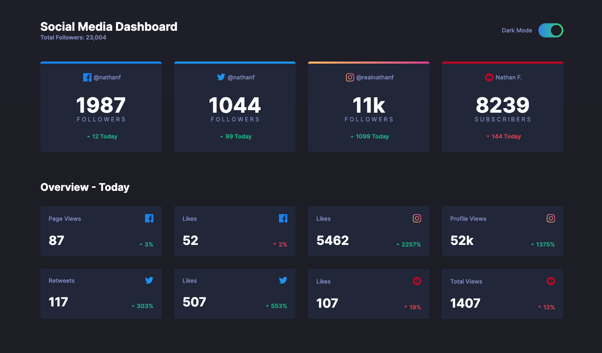

# Frontend Mentor - Social media dashboard with theme switcher solution

This is a solution to the [Social media dashboard with theme switcher challenge on Frontend Mentor](https://www.frontendmentor.io/challenges/social-media-dashboard-with-theme-switcher-6oY8ozp_H). Frontend Mentor challenges help you improve your coding skills by building realistic projects. 

## Table of contents

- [Overview](#overview)
  - [The challenge](#the-challenge)
  - [Screenshot](#screenshot)
  - [Links](#links)
- [My process](#my-process)
  - [Built with](#built-with)
  - [Useful resources](#useful-resources)
- [Author](#author)

## Overview

### The challenge

Users should be able to:

- View the optimal layout for the site depending on their device's screen size
- See hover states for all interactive elements on the page
- Toggle color theme to their preference

### Screenshot



### Links

- Solution URL: [https://www.frontendmentor.io/solutions/social-media-dashboard-solution-fr7apdQzns](https://www.frontendmentor.io/solutions/social-media-dashboard-solution-fr7apdQzns)
- Live Site URL: [https://andrecaldeiras.github.io/Social-Media-Dashboard/](https://andrecaldeiras.github.io/Social-Media-Dashboard/)

## My process

### Built with

- Semantic HTML5 markup
- CSS custom properties
- Flexbox
- CSS Grid
- Mobile-first workflow
- Javascript

```html
<div class="container-head top-bg">
    <div class="dash-title">
      <h1>Social Media Dashboard</h1>
      <p class="total-info">Total Followers: 23,004</p>
    </div>
    <div class="mode-switch">
      <p>Dark Mode</p>
      <label class="switch">
        <input id="togBtn" type="checkbox" onclick="ModeSwitch()">
        <span class="slider round"></span>
      </label>
    </div>
  </div>
```
```css
.container--overview
    display: grid
    grid-template-columns: repeat(4, 1fr) 
    grid-auto-rows: minmax(100px, auto)
    gap: 30px

.overview-title
    display: flex
    align-items: flex-end
    font-size: 25px
    font-weight: 700
    color: hsl(228, 12%, 44%)
    margin: 0

    &.card-scores-color
        color: white
```
```js
  for(const card of cardColor) {
    card.classList.toggle("card-bg-darkmode");
  }
```

### Useful resources

- [Javascript Element.classList](https://developer.mozilla.org/en-US/docs/Web/API/Element/classList) - This helped me with the javascript used in this exercise.
- [CSS Grid Complete Guide and Tricks](https://css-tricks.com/snippets/css/complete-guide-grid/) - This is a great guide on how to use CSS Grid and its tricks.


## Author

- Frontend Mentor - [@andrecaldeiras](https://www.frontendmentor.io/profile/andrecaldeiras)